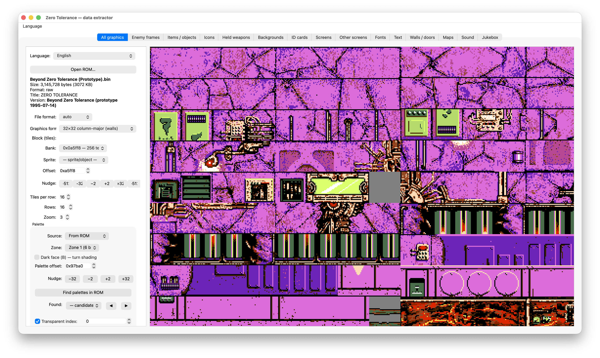

# ztextractor — Zero Tolerance data inspector

A desktop tool (Python + PySide6) for **inspecting and exporting the data** of *Zero Tolerance*
(Sega Mega Drive / Genesis) from a ROM you supply: graphics (tiles, sprites, screens, fonts),
palettes, text, audio (GEMS PCM samples, FM instruments, music), level maps, and more.



*The «All graphics» tab browsing tile/texture data from a user-supplied ROM. The UI is bilingual
(English / Русский). / Вкладка «Вся графика»: просмотр тайлов/текстур из предоставленного ROM.
Интерфейс двуязычный (English / Русский).*

> Created by me with heavy use of **Claude (Anthropic's AI)** for the reverse-engineering and analysis
> behind the data formats.
>
> ⚠ Developed and tested **only on macOS**. Python + PySide6 is cross-platform, so Linux/Windows should
> work, but they are untested. / Разрабатывалось и тестировалось **только на macOS**; Python + PySide6
> кроссплатформенны, Linux/Windows должны работать, но не проверялись.

## Requirements
- **Python 3.10+**
- **PySide6** (`pip install PySide6`)
- **Your own copy of the ROM** — not included; you supply it yourself. No game data ships in this repo.

**Sound is optional.** Graphics, text, level maps and the **PCM sound samples** all work out of the
box. Only **FM music** (GEMS songs / the Jukebox / FM-instrument audition) needs the **Nuked-OPN2**
YM2612 emulator (a **C compiler** + its sources). **Want sound? See
[`ztextractor/opn2/README.md`](ztextractor/opn2/README.md).** Without it, the tool simply hides FM
music and runs normally.

## Supported builds
The build is auto-detected from the ROM you open:
- **Zero Tolerance** — the original release and the German build
- **Zero Tolerance Underground** — the official mod (v1.5)
- **Beyond Zero Tolerance** — the *June* (1995-06-23) and *July* (1995-07-14) prototypes

Different builds expose different data, so some tabs vary by build.

## Run
```bash
pip install PySide6
python main.py
```
Open your ROM from the tool; browse/export via the tabs (graphics, fonts, audio, maps, …).

## What it does NOT contain
No ROM, no extracted game assets, no disassembly listings — it only **reads a ROM you provide** and
shows/exports its contents (the way an emulator or a font/sprite viewer does).

## License
- Tool source code: **LGPL-3.0-or-later** — © 2026 Willy Wodka. Full text in `COPYING.LESSER`
  (plus `COPYING` for the GPL-3.0 it extends).
- The GEMS player/decoder (`ztextractor/gems*.py`) is derived from **realmonster/GEMS** (LGPL-3.0-or-later);
  the original copyright notice is kept in those files.
- `ztextractor/opn2/` Nuked-OPN2 sources (fetched separately) are **LGPL-2.1**, © Alexey Khokholov.
- The map-cell icons in `ztextractor/mapres/` are from the **BZTEdit** editor (see Acknowledgements).
- *Zero Tolerance* and its data are © their respective rights holders; nothing of it is in this repo.

## Acknowledgements
- **Smoke** — the **BZTEdit** editor; the map-cell icons in `ztextractor/mapres/` come from it.
- **alex-west** — **zmap-tools** (ZMAP level format and ZT texture-bank references).
- **Firewing** & **Lurler** — **ZTEdit** / its modified version (ZMAP format).
- **Dr MeFiSto** (<https://github.com/lab313ru>) — the Ghidra plugin for reverse-engineering Mega Drive games.
- **realmonster** — GEMS tools (<https://github.com/realmonster/GEMS>); the GEMS music player/decoder here is based on them (sequence events, FM instruments, player timing).
- **ValleyBell** — GEMSPlay (GEMS PCM sample-bank format).
- **Nuked-OPN2** by **nukeykt** — the YM2612 emulator used for FM-music playback.
- **Claude (Anthropic)** — reverse-engineering and analysis of the data formats.

---
---

# ztextractor — инспектор данных Zero Tolerance

Десктоп-инструмент (Python + PySide6) для **просмотра и экспорта данных** игры *Zero Tolerance*
(Sega Mega Drive / Genesis) из ROM, который ты предоставляешь сам: графика (тайлы, спрайты, экраны,
шрифты), палитры, текст, звук (PCM-сэмплы и FM-инструменты GEMS, музыка), карты уровней и т.д.

> Сделано при активном участии **Claude (ИИ от Anthropic)** в реверс-инжиниринге и анализе форматов
> данных.

## Требования
- **Python 3.10+**
- **PySide6** (`pip install PySide6`)
- **Свой ROM** — в репозитории его нет; предоставляешь сам. Никаких игровых данных в репозитории нет.

**Звук опционален.** Графика, текст, карты уровней и **PCM-сэмплы** работают из коробки. Только
**FM-музыка** (песни GEMS / Jukebox / прослушивание FM-инструментов) требует эмулятор YM2612
**Nuked-OPN2** (**компилятор C** + его исходники). **Нужен звук? См.
[`ztextractor/opn2/README.md`](ztextractor/opn2/README.md).** Без него инструмент просто скрывает
FM-музыку и работает как обычно.

## Поддерживаемые сборки
Сборка определяется автоматически по открытому ROM:
- **Zero Tolerance** — оригинальный релиз и немецкая версия
- **Zero Tolerance Underground** — официальный мод (v1.5)
- **Beyond Zero Tolerance** — прототипы *June* (1995-06-23) и *July* (1995-07-14)

Разные сборки содержат разные данные, поэтому часть вкладок зависит от сборки.

## Запуск
```bash
pip install PySide6
python main.py
```
Открой ROM в инструменте; смотри/экспортируй по вкладкам (графика, шрифты, звук, карты, …).

## Чего здесь НЕТ
Нет ROM, нет выдранных ассетов игры, нет листингов дизассемблера — инструмент только **читает твой ROM**
и показывает/экспортирует его содержимое (как эмулятор или просмотрщик спрайтов/шрифтов).

## Лицензия
- Код инструмента: **LGPL-3.0-or-later** — © 2026 Willy Wodka. Полный текст в `COPYING.LESSER`
  (и `COPYING` — GPL-3.0, на котором она основана).
- GEMS-плеер/декодер (`ztextractor/gems*.py`) — производное от **realmonster/GEMS** (LGPL-3.0-or-later);
  исходное уведомление об авторстве сохранено в этих файлах.
- Исходники Nuked-OPN2 в `ztextractor/opn2/` (качаются отдельно) — **LGPL-2.1**, © Alexey Khokholov.
- Иконки клеток карты в `ztextractor/mapres/` — из редактора **BZTEdit** (см. Благодарности).
- *Zero Tolerance* и её данные © правообладателям; ничего из этого в репозитории нет.

## Благодарности
- **Smoke** — редактор **BZTEdit**; иконки клеток карты в `ztextractor/mapres/` взяты из него.
- **alex-west** — **zmap-tools** (формат уровней ZMAP и банки текстур ZT).
- **Firewing** и **Lurler** — **ZTEdit** / его модифицированная версия (формат ZMAP).
- **Dr MeFiSto** (<https://github.com/lab313ru>) — плагин для Ghidra под реверс игр Mega Drive.
- **realmonster** — инструменты GEMS (<https://github.com/realmonster/GEMS>); GEMS-плеер/декодер здесь сделан на их основе (события секвенций, FM-инструменты, тайминг плеера).
- **ValleyBell** — GEMSPlay (формат банка PCM-сэмплов GEMS).
- **Nuked-OPN2** от **nukeykt** — эмулятор YM2612 для воспроизведения FM-музыки.
- **Claude (Anthropic)** — реверс-инжиниринг и анализ форматов данных.
